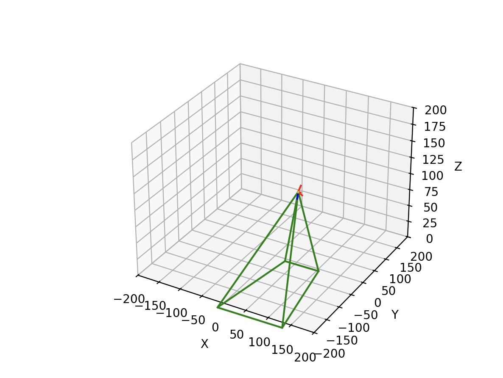

# Spacetime – spatial realtids-presentation av drönarvideo
Spacetime is a tool to visualise drone footage by projecting it onto a map in real time. A Python backend uses the telemetry data from the drone to calculate the area encompassed by the cameras field of view, as seen in the image bellow. 

The this data is used to visulize the drone footage in a frontend writen in react as seen in the image bellow.

## Workflow
This is the recommended development workflow for this project:

- The `dev` branch is the main development branch. All new features should be developed in a seperate branch and then merged into `dev` when they are finished. This is also called the "feature branch workflow" and you can read more [here](https://www.atlassian.com/git/tutorials/comparing-workflows/feature-branch-workflow)
- When a new release/demo is decided on this will be pushed into `main` to remain undisturbed and let development continue in `dev`. This is do avoid last minute errors when its time to demo something.
- Commit messages should be written in the imperative mood, and should follow
  [Conventional Commits](https://www.conventionalcommits.org/), i.e, the commit
  message should begin with one of the following:
  - `build:` - Changes that affect the build system or external dependencies
  - `ci:` - Changes to our CI configuration files and scripts
  - `docs:` - Documentation only changes
  - `feat:` - A new feature
  - `fix:` - A bug fix
  - `perf:` - A code change that improves performance
  - `refactor:` - A code change that neither fixes a bug nor adds a feature
  - `style:` - Changes that do not affect the meaning of the code (white
    space, formatting, missing semi-colons, etc)
  - `test:` - Adding or correcting tests

A good article for how to write good commit messages [The seven rules of a
great Git commit
message](https://chris.beams.io/posts/git-commit/#seven-rules).

## Setup
See READMEs in both frontend and backend

